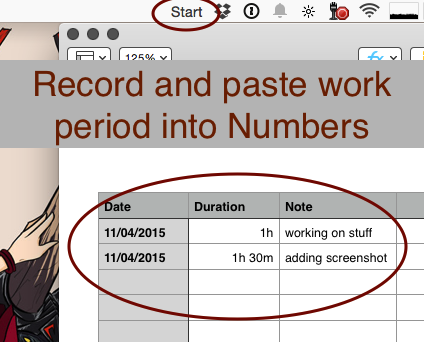

A very simple Menu Bar App that copies your working period to clipboard so you can paste it into Numbers/Word.

## Warning
This app rounds minutes up or down to the next 15 minutes.

## How to quite the app
Right click the menu bar app.

## Date Format
The content inside the clipboard is formatted `08.04.2015	08:00	12:00`. But you can easily modify it in the code.

## Status Bar in 10.10
As mentioned on [stackoverflow](http://stackoverflow.com/a/26198173/279890) NSStatusItem has since 10.10 a property `button` which returns you a NSStatusBarButton to configure.

## Icon Format
I used a simple script to cut an image into the required icon formats. https://gist.github.com/yene/1b5e980a1af28f4f5d37

## Todo
* Add put into startup item to the right click menu.